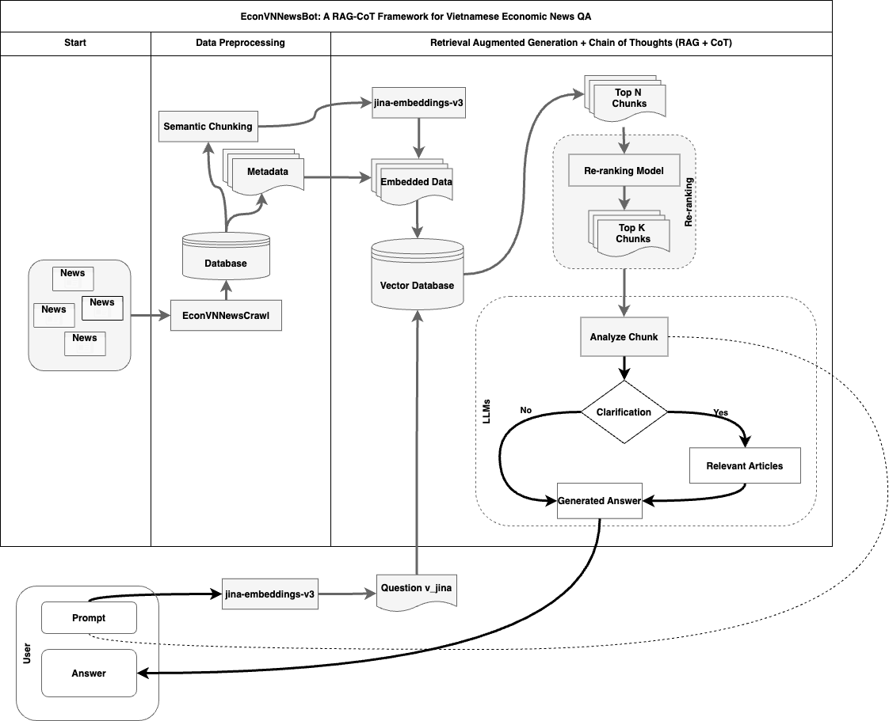

# EconVNNewsBot

**EconVNNewsBot** is an advanced question-answering system that leverages **Retrieval-Augmented Generation (RAG)** and **Chain of Thought (CoT) reasoning** to process queries related to Vietnamese economic news. This system is designed to efficiently retrieve relevant articles and synthesize comprehensive answers, offering contextually accurate and precise information. By combining cutting-edge NLP techniques such as vector-based retrieval, re-ranking, and thought reasoning, EconVNNewsBot addresses the complexities of economic news with ease.

---

## Table of Contents

1. [Project Overview](#project-overview)
2. [Features](#features)
3. [System Architecture](#system-architecture)
4. [Installation](#installation)
5. [Usage](#usage)
6. [Repository Structure](#repository-structure)
7. [Contributing](#contributing)
8. [License](#license)
9. [Contact](#contact)

---

## Project Overview

EconVNNewsBot is built to streamline the querying of Vietnamese economic news. With a dataset encompassing over 268,000 articles from major news sources like VNExpress, VietnamNet, and CafeF, the system provides a robust solution for answering economic queries with high accuracy and context. By combining the power of **semantic chunking**, **vector-based retrieval**, and **re-ranking models**, it ensures that users receive reliable answers, even for complex queries.

**Key Highlights**:

- **Retrieval-Augmented Generation (RAG)** methodology ensures relevant article retrieval and refined answers using multiple sources.
- Utilization of the **Chain of Thought (CoT)** mechanism to break down complex questions into manageable reasoning steps.
- A user-friendly **Streamlit-based interface** allows for intuitive query input, filtering by date, source, and category.



The above figure shows the overall architecture of the EconVNNewsBot system, which integrates multiple components such as EconVNNewsCrawl for data collection, semantic chunking, embedding-based retrieval, and Chain of Thought reasoning to generate detailed answers.

---

## Features

- **Advanced Economic Query Processing**: The system allows users to ask natural language questions related to Vietnamese economic news and generates detailed answers by retrieving and analyzing relevant news articles.
- **Chain of Thought Reasoning**: The CoT mechanism ensures that answers are synthesized by reasoning through multiple articles, ensuring coherent and in-depth responses.
- **Streamlit UI**: The interface provides easy query input and filtering options to refine search results based on category, date, or source.
- **Re-ranking and Semantic Chunking**: The system uses advanced Vietnamese embeddings and cosine similarity to prioritize the most relevant content, offering answers that are contextually relevant and precise.
- **Comprehensive Dataset**: The underlying dataset includes articles from 2020 to 2024, ensuring that answers are based on the most up-to-date information available.

---

## System Architecture

EconVNNewsBot’s architecture consists of several components working in unison to deliver accurate and contextually relevant answers:

1. **Data Collection**: The **EconVNNewsCrawl** tool aggregates Vietnamese economic news from multiple reliable sources, ensuring comprehensive data coverage.
2. **Data Preprocessing and Chunking**: Collected articles are semantically chunked into manageable pieces, which are then embedded using the **jina-embeddings-v3** model.
3. **Vector Database**: Pinecone is used to store the embeddings of articles, enabling fast and efficient similarity searches between user queries and articles.
4. **Re-ranking and CoT**: The top articles retrieved from Pinecone are reranked based on relevance using the **jina-reranker-v2-base-multilingual** model. CoT then processes the highest-ranked articles to synthesize an answer.
5. **Frontend UI**: The Streamlit-based interface allows users to input queries and filter search results based on multiple criteria.

Below is a visual representation of how the system operates from data collection to answer generation:


---

## Installation

### Prerequisites

To install and run EconVNNewsBot, the following dependencies are required:

- Python 3.8 or higher
- Pip
- Pinecone API key (for vector search)
- OpenAI API key (for GPT-based text processing)

### Installation Steps

1. **Clone the Repository**:

   ```bash
   git clone https://github.com/KhoaLearn/EconVNNewsBot.git
   cd EconVNNewsBot
   ```
2. **Set Up a Virtual Environment**:

   ```bash
   python3 -m venv venv
   source venv/bin/activate
   ```
3. **Install Dependencies**:

   ```bash
   pip install -r requirements.txt
   ```
4. **Set Up API Keys**:

   Create a `.env` file at the project root with the following variables:

   ```bash
   PINECONE_API_KEY=your_pinecone_api_key
   OPENAI_API_KEY=your_openai_api_key
   ```

---

## Usage

### Running the Streamlit App:

To start the EconVNNewsBot application, use the following command:

```bash
streamlit run views/streamlit_ui.py
```

Once the app is launched, users can:

- **Submit queries** on Vietnamese economic news.
- **Filter results** by category, source, and date to narrow down relevant articles.
- **View synthesized answers** with references to the original sources.


In the figure above:

1. **Input Options**: Users can select categories, sources, and date ranges to customize their queries.
2. **Date Filters**: Specify a date range to limit search results to a specific time period.
3. **Query History**: View previously submitted queries for easy reference.
4. **Detailed Answer**: The system retrieves and displays detailed answers along with references.
5. **References**: All answers are sourced from the most relevant articles, which are displayed for verification and further reading.

---

## Repository Structure

```bash
EconVNNewsBot/
│
├── controller/                # Core logic for managing the QA process
│   ├── categories.csv          # List of categories for filtering
│   ├── cot_controller.py       # Chain of Thought reasoning module
│   ├── question_controller.py  # Manages question-answering pipeline
│   ├── rag_controller.py       # Handles retrieval and re-ranking of articles
│   ├── source.csv              # News sources for filtering
│
├── docs/
│   ├── EconVNNewsBot.png        # System architecture diagram
│   ├── UI_system.png            # User interface screenshot
├── docs/QA_test_result                       # Documentation and images
│   ├──├── 
│   ├──├── QA_1.png   
│   ├──├── ...
│
├── src/                        # Source code for embedding models
│   └── model.py                # Embedding model using Vietnamese embeddings
│
├── views/                      # Streamlit UI components
│   ├── about_ui.py             # About page UI
│   └── streamlit_ui.py         # Main application for querying and displaying results
│
├── .env                        # Environment variables (OpenAI and Pinecone API keys)
├── .gitignore                  # Git ignore file
├── LICENSE                     # License for the project
├── README.md                   # Project documentation
├── requirements.txt            # List of dependencies
└── app.py                      # Backend entry point
```

---

## Contributing

Contributions are welcome to further improve the system’s functionality and performance. To contribute:

1. **Fork the repository**.
2. **Create a new branch** with your feature or fix.
3. **Submit a pull request** with a detailed explanation of your changes.

Please ensure that your code adheres to the project’s style guidelines and includes appropriate tests where necessary.

---

## License

This project is licensed under the MIT License. For more details, refer to the [LICENSE](LICENSE) file.

---

## Contact

For inquiries or issues, please feel free to open an issue on GitHub or contact the project maintainers through my contact: khoale.maiu@gmail.com
