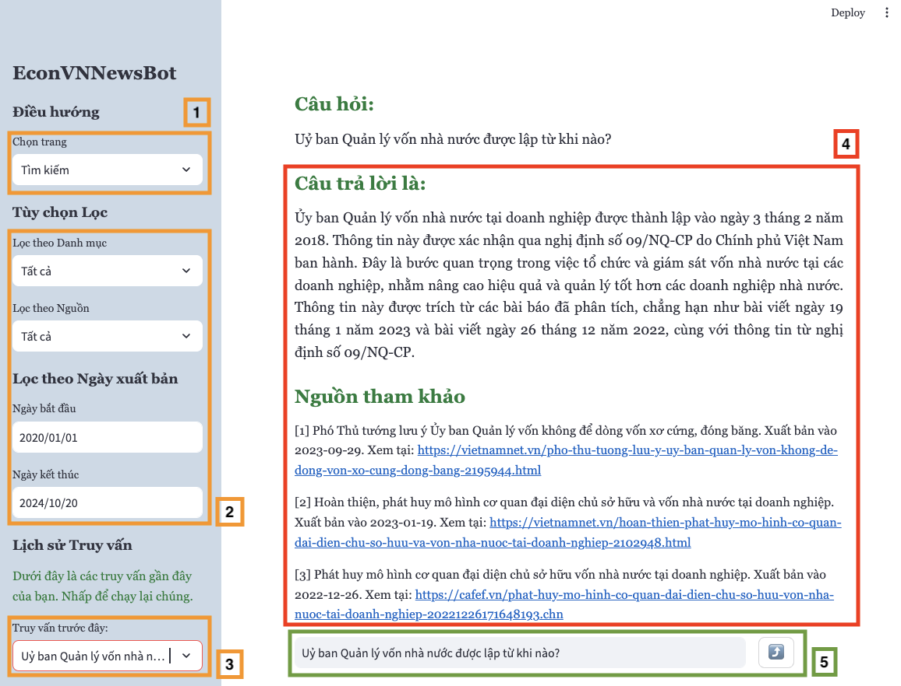

# EconVNNewsBot

**EconVNNewsBot** is an advanced question-answering system that utilizes **Retrieval-Augmented Generation (RAG)** and **Chain of Thought (CoT) reasoning** to process queries on Vietnamese economic news. This system efficiently retrieves relevant articles and synthesizes comprehensive answers, delivering contextually accurate and precise information. By combining cutting-edge NLP techniques such as vector-based retrieval, re-ranking, and thought reasoning, EconVNNewsBot addresses the complexities of economic news.

---

## Table of Contents

1. [Project Overview](#project-overview)
2. [Features](#features)
3. [System Architecture](#system-architecture)
4. [Installation](#installation)
5. [Usage](#usage)
6. [Repository Structure](#repository-structure)
7. [Contributing](#contributing)
8. [License](#license)
9. [Contact](#contact)

---

## Project Overview

EconVNNewsBot streamlines the querying of Vietnamese economic news. With a dataset of over 268,000 articles from sources such as VNExpress, VietnamNet, and CafeF, the system provides a robust solution for delivering accurate and relevant economic information. Utilizing **semantic chunking**, **vector-based retrieval**, and **re-ranking models**, it ensures that users receive comprehensive answers, even for complex queries.

**Key Highlights**:

- **Retrieval-Augmented Generation (RAG)** for effective retrieval and answer refinement from multiple sources.
- **Chain of Thought (CoT)** mechanism to decompose complex queries into logical steps.
- Intuitive **Streamlit-based interface** for easy query input and filtering by date, source, and category.

---

## Features

- **Advanced Economic Query Processing**: Handles natural language questions related to Vietnamese economic news, providing in-depth answers by retrieving and analyzing relevant articles.
- **Chain of Thought Reasoning**: Synthesizes answers by reasoning across multiple articles to ensure coherence and depth.
- **Streamlit UI**: User-friendly interface with options for query input and filtering based on category, date, or source.
- **Re-ranking and Semantic Chunking**: Uses Vietnamese embeddings and cosine similarity to prioritize relevant content, offering precise, contextually relevant answers.
- **Comprehensive Dataset**: Includes articles from 2020 to 2024, ensuring answers are based on up-to-date information.

---

## System Architecture

The architecture of EconVNNewsBot comprises several components working in unison to deliver accurate and contextually relevant answers:

1. **Data Collection**: The **EconVNNewsCrawl** tool gathers Vietnamese economic news from reliable sources.
2. **Data Preprocessing and Chunking**: Articles are semantically chunked and embedded using the **jina-embeddings-v3** model.
3. **Vector Database**: Embeddings are stored in Pinecone, enabling efficient similarity-based retrieval.
4. **Re-ranking and CoT**: The retrieved articles are re-ranked with the **jina-reranker-v2-base-multilingual** model, and CoT processes the top articles to generate a coherent answer.
5. **Frontend UI**: The Streamlit-based interface allows users to input queries and filter results.

Below is a visual representation of the system's workflow:



---

## Installation

### Prerequisites

- Python 3.8 or higher
- Pip
- Pinecone API key (for vector search)
- OpenAI API key (for GPT-based text processing)

### Installation Steps

1. **Clone the Repository**:

   ```bash
   git clone https://github.com/KhoaLearn/EconVNNewsBot.git
   cd EconVNNewsBot
   ```
2. **Set Up a Virtual Environment**:

   ```bash
   python3 -m venv venv
   source venv/bin/activate
   ```
3. **Install Dependencies**:

   ```bash
   pip install -r requirements.txt
   ```
4. **Set Up API Keys**:

   Create a `.env` file at the project root with the following variables:

   ```bash
   PINECONE_API_KEY=your_pinecone_api_key
   OPENAI_API_KEY=your_openai_api_key
   ```

---

## Usage

### Running the Streamlit App:

To start the EconVNNewsBot application, use the following command:

```bash
streamlit run app.py
```

Upon launching the app, users can:

- **Submit queries** on Vietnamese economic news.
- **Filter results** by category, source, and date to refine relevant articles.
- **View synthesized answers** with references to the original sources.

---

## Repository Structure

```bash
EconVNNewsBot/
│
├── controller/                # Core logic for managing QA process
│   ├── categories.csv          # List of categories for filtering
│   ├── cot_controller.py       # Chain of Thought reasoning module
│   ├── question_controller.py  # Manages question-answering pipeline
│   ├── rag_controller.py       # Handles retrieval and re-ranking of articles
│   ├── source.csv              # News sources for filtering
│
├── docs/                       # Documentation and images
│   ├── EconVNNewsBot.png       # System architecture diagram
│   ├── UI_system.png           # User interface screenshot
│
├── src/                        # Source code for embedding models
│   └── model.py                # Embedding model using Vietnamese embeddings
│
├── views/                      # Streamlit UI components
│   ├── about_ui.py             # About page UI
│   └── streamlit_ui.py         # Main application for querying and displaying results
│
├── .env                        # Environment variables (OpenAI and Pinecone API keys)
├── .gitignore                  # Git ignore file
├── LICENSE                     # License for the project
├── README.md                   # Project documentation
├── requirements.txt            # List of dependencies
└── app.py                      # Backend entry point
```

---

## Contributing

Contributions are welcome to further improve the system’s functionality. To contribute:

1. **Fork the repository**.
2. **Create a new branch** with your feature or fix.
3. **Submit a pull request** with a detailed explanation of your changes.

---

## License

This project is licensed under the MIT License. See the [LICENSE](LICENSE) file for details.

---

## Contact

For inquiries or issues, open an issue on GitHub or contact the project maintainer at khoale.maiu@gmail.com.
